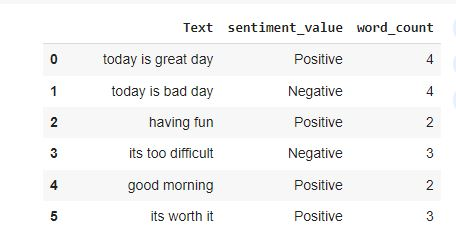

# Sentiment Analysis using NLP in Python
Sentiment Analysis using NLP in Python that includes data preprocessing, normalization, removal of stopwords, and sentiment analysis using a classification model. Additionally, n-gram analysis (unigram, bigram, trigram) is performed to capture contextual information in the text. The results are tabulated in a table where the output is positive, negative, or neutral. There is a dataset that contains stopwords and a dataset that contains words each assigned with a sentiment value to properly evaluate the output. The results are calculated with the sentiment value which we get from the preassigned values for specific words. The results generated are accurate but there are few exceptions because of the sentiment value achieved which makes it difficult to obtain the expected output. 

# Steps:
1. Open the Sentiment_Analysis.ipynb file in Jupyter Notebook or Google Colab.
2. Make sure to upload the required CSV files and txt file (Tweets_data.csv, Afinn.csv, stop.txt) before running the code.

# Output:

